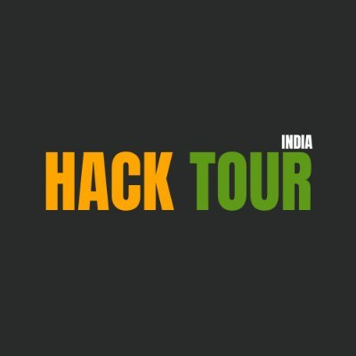

<picture>
  <source media="(prefers-color-scheme: dark)" srcset="https://capsule-render.vercel.app/api?type=waving&height=200&color=1a1b27&text=Jatin%20Sahijwani&fontSize=52&fontColor=70a5fd&fontAlignY=34&desc=Zero-knowledge%20tooling%20%7C%20privacy%20protocols%20%7C%20node%20infrastructure&descSize=15&descAlignY=54&animation=fadeIn&section=header">
  <source media="(prefers-color-scheme: light)" srcset="https://capsule-render.vercel.app/api?type=waving&height=200&color=70a5fd&text=Jatin%20Sahijwani&fontSize=52&fontColor=ffffff&fontAlignY=34&desc=Zero-knowledge%20tooling%20%7C%20privacy%20protocols%20%7C%20node%20infrastructure&descSize=15&descAlignY=54&animation=fadeIn&section=header">
  
</picture>

## About me

- I build **zero-knowledge developer tooling**. [`zkArb-sdk`](https://github.com/jatinsahijwani/zkArb-sdk) (55★, published on npm) takes a `.circom` file, runs the Groth16 setup, deploys the Solidity verifier to Arbitrum and verifies proofs from a single JS call — no ABI handling, no Web3 scripting. I've since ported that same pipeline to **12+ chains**; 23 of my repositories carry Circom.
- I **run infrastructure, not just repositories**. [`openlightnodes`](https://github.com/jatinsahijwani/openlightnodes) operates an independent Zcash light-client endpoint (Zebra + lightwalletd) in Mumbai — TLS, no client-IP logging, a public status page monitored from a separate host, and fully scripted deploys so anyone can reproduce it.
- I work on **trust boundaries for autonomous agents**. [`ballast`](https://github.com/jatinsahijwani/ballast) puts a revocable Move capability object between an AI agent and your funds on Sui: spend, leverage, market and expiry limits are enforced by the chain, and the trade decision is signed inside a Nitro enclave whose key is verified on-chain before DeepBook is reached.
- I **contribute upstream** — merged into [ZecHub](https://github.com/ZecHub/zechub) (58★) and [Savique](https://github.com/Elite-tch/Savique-savings), open PRs on [zecrocks/zcash-stack](https://github.com/zecrocks/zcash-stack), and a Canton Bindings proposal submitted to the [Canton Development Fund](https://github.com/canton-foundation/canton-dev-fund) (52★).
- **TypeScript** (47 repos) and **JavaScript** (70 repos) are my daily drivers; I reach for **Rust** and **Move** when the chain demands it. **626 contributions since 2023**, 44 PRs in the last twelve months.

### Currently

| | |
|---|---|
| **Working on** | [`nep641-ts`](https://github.com/jatinsahijwani/nep641-ts) — a TypeScript client for NEP-641, a Final NEAR standard that shipped with only a Rust reference · [`kage`](https://github.com/jatinsahijwani/kage) — shielded pools on Kusama Asset Hub · expanding `openlightnodes` beyond Mumbai |
| **Learning** | Midnight's [Compact](https://github.com/jatinsahijwani/prodigy) circuit language · Nautilus TEE attestation on Sui · Soroban's native BN254 host functions |

## Communities I founded

<table>
<tr>
<td width="120" align="center" valign="middle">

</td>
<td valign="middle">

### Zcash India &nbsp;·&nbsp; Founder

The official Indian community for Zcash.

</td>
</tr>
<tr>
<td width="120" align="center" valign="middle">

</td>
<td valign="middle">

### HackTour India &nbsp;·&nbsp; Founder

India's largest active developer community.

</td>
</tr>
</table>

## Tech stack

**Languages**

**Zero-knowledge**

**Chains &amp; protocols**

**Web**

**Backend &amp; infrastructure**

**Tooling**

## Featured projects

<table>
<tr>
<td width="50%" valign="top">

### [openlightnodes](https://github.com/jatinsahijwani/openlightnodes)

Most Zcash wallets reach the chain through a handful of light-client servers, almost none of them in Asia. This runs an independent one — a live TLS endpoint in Mumbai on Zebra + lightwalletd, no client-IP logging, a public status page watched from a separate host, and every deploy step scripted so others can stand up their own.

`Zebra` `lightwalletd` `Shell` `AWS` `Caddy`

</td>
<td width="50%" valign="top">

### [zkArb-sdk](https://github.com/jatinsahijwani/zkArb-sdk)

*Write Circom. Compile. Deploy. Verify — in one command.* Compiles a circuit to `.r1cs`/`.wasm`/`.zkey`, runs the Groth16 trusted setup, emits and deploys a Solidity verifier to Arbitrum One, Nova, Sepolia or any Orbit chain, and verifies proofs from a single JS call. Includes calldata-optimised verifiers and an L1 bridge for cross-chain proofs.

`Circom` `snarkjs` `Solidity` `Arbitrum` `npm`

</td>
</tr>
<tr>
<td width="50%" valign="top">

### [lineage](https://github.com/jatinsahijwani/lineage)

AI agents run on uncredited work. Lineage makes every dataset, model and skill behind an agent an on-chain iNFT, emits a TEE-signed attribution receipt to 0G DA on every inference, and pays royalties automatically to everyone in the lineage graph. Live on 0G mainnet and testnet.

`0G` `Solidity` `TypeScript` `viem` `TEE`

</td>
<td width="50%" valign="top">

### [ballast](https://github.com/jatinsahijwani/ballast)

*Give your AI agent a mandate, not your keys.* A revocable Move capability object on Sui with hard on-chain limits on spend, leverage, markets and expiry. The trade decision is signed inside a Nitro enclave whose key the chain verifies; both the capability rules and the enclave signature are checked before DeepBook v3 is reached.

`Move` `Sui` `Nautilus TEE` `DeepBook` `Next.js`

</td>
</tr>
<tr>
<td width="50%" valign="top">

### [prism](https://github.com/jatinsahijwani/prism)

An on-chain batch aggregator and compliance oracle extending Nethermind's Stellar Private Payments. Settles many real SPP transfers in a single verification at constant cost, and adds what the base pool lacks — hard in-circuit compliance caps plus auditor selective disclosure. Groth16/BN254, verified with Soroban's native host functions.

`Rust` `Soroban` `Circom` `Groth16` `BN254`

</td>
<td width="50%" valign="top">

### [kage](https://github.com/jatinsahijwani/kage)

Shielded pools on Kusama Asset Hub that hold up outside the UI. The denomination is baked into the deposit commitment and constrained *inside the circuit*, so no proof exists for an off-allow-list amount; a bundled relayer pays withdrawal gas from the shielded funds themselves, with fee and recipient bound into the SNARK's public inputs. Ships an architecture doc and a threat model.

`Circom` `Solidity` `Kusama` `Relayer` `TypeScript`

</td>
</tr>
</table>

<b>More projects</b>

 

- **[nep641-ts](https://github.com/jatinsahijwani/nep641-ts)** — TypeScript client for NEP-641, *Offchain Authorizations for Smart Contracts*. The standard reached Final with only a Rust reference; this ships the signable envelope, its canonical hash, the NEP-413 mapping and the recursive offchain resolver.
- **[zk-ava-sdk](https://github.com/jatinsahijwani/zk-ava-sdk)** — the Circom-to-verifier pipeline on Avalanche, published to npm. [Live demo](https://zk-ava-sdk.vercel.app).
- **[starkshield](https://github.com/jatinsahijwani/starkshield)** — the same toolkit for Starknet, generating Cairo verifiers through Garaga on Sepolia.
- **[prism-sdk](https://github.com/jatinsahijwani/prism-sdk)** — an MIT zero-knowledge toolkit for Soroban built on Stellar's X-Ray primitives (BN254 pairings, Poseidon), shipped at Stellar Builders Camp, McLeod Ganj.
- **[zero-shield](https://github.com/jatinsahijwani/zero-shield)** — the Base variant: zero-knowledge proofs for JavaScript developers with no cryptography background.
- **[zk-sui-sdk](https://github.com/jatinsahijwani/zk-sui-sdk)** · **[zk-aptos-sdk](https://github.com/jatinsahijwani/zk-aptos-sdk)** · **[zk-polka-verifier-sdk](https://github.com/jatinsahijwani/zk-polka-verifier-sdk)** · **[zk-hydra-sdk](https://github.com/jatinsahijwani/zk-hydra-sdk)** — the same pipeline ported to Sui, Aptos, Polkadot and Hydra.
- **[prodigy](https://github.com/jatinsahijwani/prodigy)** — a Midnight Compact commit-reveal circuit plus a client-side simulator that reproduces the contract's phase logic in the browser, so you can play the round without the Compact toolchain.
- **[frostvault](https://github.com/jatinsahijwani/frostvault)** — ZecHub Hackathon 2026 submission, merged upstream into [ZecHub/zechub](https://github.com/ZecHub/zechub).
- **[ryo-protocol](https://github.com/jatinsahijwani/ryo-protocol)** — a zero-knowledge prediction market where bets stay hidden from front-runners until resolution, settled over Yellow state channels in Circle USDC.
- **[buidl-with-stylus-india](https://github.com/jatinsahijwani/buidl-with-stylus-india)** — the Arbitrum BUIDL Tour India repo: workshop content, Rust/Stylus examples and regional-language material aimed at 5,000+ students across 50+ cities, run openly with the Arbitrum DAO.
- **[zkarb-sdk-demo](https://github.com/jatinsahijwani/zkarb-sdk-demo)** — the hands-on companion to the workshops above, **forked 117 times** by attendees.
- **[dao-ao-project](https://github.com/jatinsahijwani/dao-ao-project)** — a DAO built on AO / Arweave.
- **[ByteProgrammingLanguage](https://github.com/jatinsahijwani/ByteProgrammingLanguage)** — a dynamically typed language implemented in statically typed C++, from before the Web3 detour.

## Open-source contributions

| Project | | Contribution |
|---|---|---|
| [**ZecHub/zechub**](https://github.com/ZecHub/zechub) |  | Added `frostvault` to the decentralised Zcash education hub — ZecHub Hackathon 2026 submission. **Merged.** |
| [**canton-foundation/canton-dev-fund**](https://github.com/canton-foundation/canton-dev-fund) |  | Submitted a *Canton Bindings* proposal to the Canton Development Fund. |
| [**zecrocks/zcash-stack**](https://github.com/zecrocks/zcash-stack) |  | Fixed the Caddy compose file so the Zcash stack parses and runs. *Open.* |
| [**Elite-tch/Savique-savings**](https://github.com/Elite-tch/Savique-savings) |  | Added zero-knowledge proof-of-savings to an on-chain savings platform, using `zkArb-sdk`. **Merged.** |
| [**t-phoenix/rekt_ceo**](https://github.com/t-phoenix/rekt_ceo) |  | ZK verification. *Open.* |

## Stats

  

  

  

  

<picture>
  <source media="(prefers-color-scheme: dark)" srcset="https://raw.githubusercontent.com/jatinsahijwani/jatinsahijwani/output/github-snake-dark.svg">
  <source media="(prefers-color-scheme: light)" srcset="https://raw.githubusercontent.com/jatinsahijwani/jatinsahijwani/output/github-snake.svg">
  
</picture>

## Connect

  

<picture>
  <source media="(prefers-color-scheme: dark)" srcset="https://capsule-render.vercel.app/api?type=waving&height=120&color=1a1b27&section=footer">
  <source media="(prefers-color-scheme: light)" srcset="https://capsule-render.vercel.app/api?type=waving&height=120&color=70a5fd&section=footer">
  
</picture>

